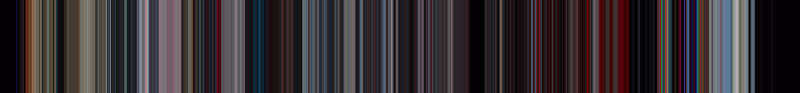

# Movie-barcode generator

This script creates a color snapshot for every second of a movie and combines all snapshots together into a 3400x400 pixel movie-barcode image.

**Example:**


## How does it work?

1. For a 90 minute movie the script would create a 5400 1x1 pixel screenshots in the `.tmp` folder.
2. Then it combines all screenshots into a `5400x1` pixel image and saves it into the `barcodes/original` folder. And clears the `.tmp` folder.
3. After that it resizes the "original" image into a `3400x400` pixel image and saves it into the `barcodes` folder.

You can customize the final output resolution in the `convert.sh` script.

## Prerequisite

- ffmpeg & ImageMagick

Can be installed using homebrew on MacOs:

```bash
$ brew install ffmpeg imagemagick
```

## Getting started

Just run following command to generate barcode:

```bash
$ sh ./generate.sh "PATH_TO_THE_MOVIE" "NAME_OF_THE_IMAGE"
```

NAME_OF_THE_IMAGE (optional)

## Bonus

You can also re-convert all images saved in `barcodes/original`, by running:

```bash
$ sh ./convert.sh
```
